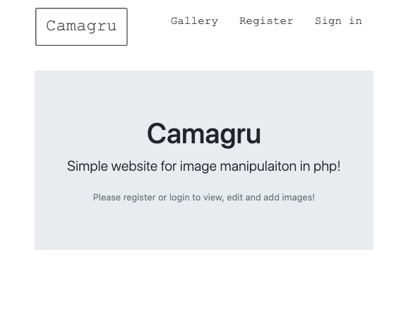

 
## Instagram / Snapchat style website

### Description

The aim of this project was to make a small social media site with simple image editing features. Only CSS frameworks were allowed, no other frameworks.

I created the site using the MVC model for easy maintanability.

### Installation.

Copy files to your www root folder.

Modify ```config/config.php``` **URLROOT** variable to match your server settings.

Modify ```config/database.php``` To match your mysql server settings.

_Example_
```php
		$DB_HOST='localhost';
		$DB_USER='root';
		$DB_PASSWORD='password';
		$DB_NAME='camagru';
```
Application will create database at first run. Important parts are user and password.

### Screenshots
----
#### Front page


#### Register page


#### Login page


#### Recover password


#### Edit profile page


#### Add photo


#### Gallery page


#### Comment image
